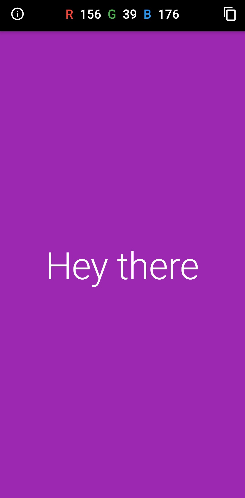
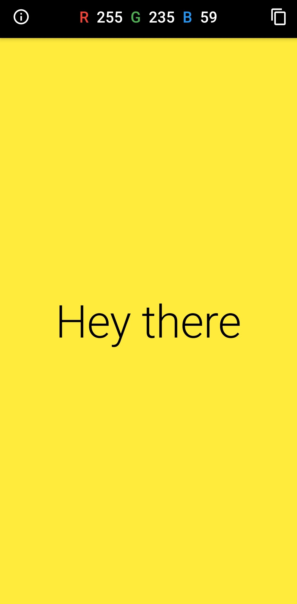
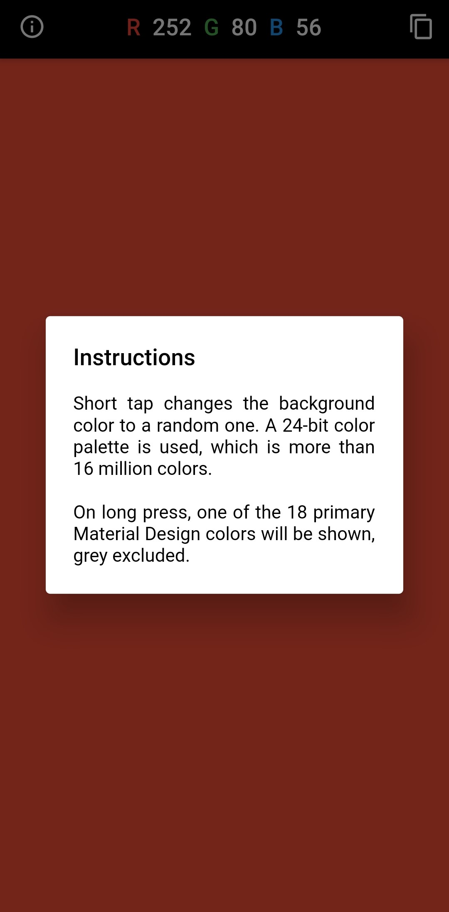
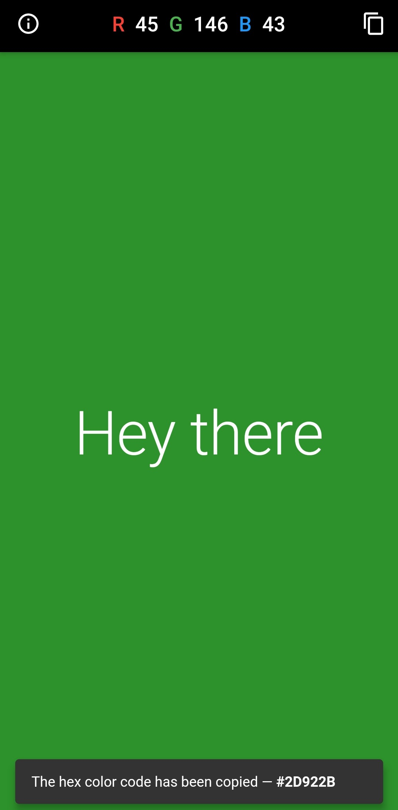

# Flutter Random Color Generator

Changes the background color to a random one on tap.

## Additional Features

- Shows a random primary Material color on long press.
- Shows the corresponding RGB values in the AppBar.
- The text color is dynamic, and is always readable.
- Has a button to copy the hex color code to the clipboard.
- Has a message with instructions for new users.
- The taps have that nice animated feedback effect, which is my personal favorite :)

Tested on Android, Web and Desktop.

## Screenshots

## Instructions

1. [Install Flutter](https://flutter.dev/docs/get-started/install).
2. Clone this project and `cd` into it.
3. Run `flutter create .` to recreate the missing project files.
4. Ensure you have an available device in `flutter devices`.
5. Build and run the app: `flutter run --release`.

To check your Flutter installation for possible problems, run `flutter doctor`.
